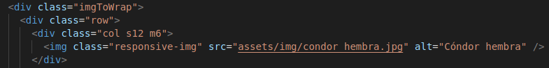
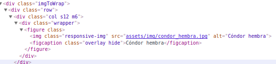

# Cardify    
 

# Proyecto Cardify

Cardify es un proyecto diseñado para Laboratoria, es una librería (plugin) de JQuery que se ejecuta en un contenedor con la clase imageToWrap, buscando todas las imágenes que encuentra dentro del contenedor y reemplazándolas por un nuevo elemento `<figure>` que contiene la imagen además de un `<figcaption>` con el texto del atributo alt de la imagen.

## Metodología de trabajo

* Utilizamos la metodología Agile, para mejorar la eficiencia en la producción y la calidad de nuestro producto.

* Como herramienta de planificación utilizamos Trello, para tener un mayor orden en las tareas encomendadas y la claridad de lo que necesitariamos para llevar a cabo el proyecto.

* Utilizamos WhatsApp y Slack para poder mantenernos conectadas en todo momento y así tener una comunicación clara al momento de realizar cualquier cambio en el proyecto o actualizaciones.

## Requerimientos Técnicos

El proyecto fue realizado con los siguientes recursos:

* Dependencias de Producción
  - jQuery `~v.3.3.1`
  - Materialize `~v.0.100.2`

* Dependencias de Desarrollo

  - Chai `~v.4.1.2`
  - Mocha `~v.5.0.0`
  - Node.js `~v.9.4.0`
  - Eslint `~v.4.16.0`
  - NPM `~v.5.6.0`
  - Uniq `~v.1.0.1`

***

## Instalación
####Global (navegador)

``
***

Para comenzar necesitas tener instalado [Node](https://nodejs.org/es/).

1.  Abre la terminal y digita `npm init` para inicializar npm en tu proyecto.
2. En la terminal corre `npm install cardifyproyect` para instalar el plugin.
3. Es necesario instalar [Browserify](http://browserify.org/) `npm install -g browserify`

***

## Ejemplos

Inicialmente tu código se vería así:

>

Al aplicar el plugin cardify, tu estructura se verá así.
>

Al pasar el cursor sobre las imagenes veras este efecto.

